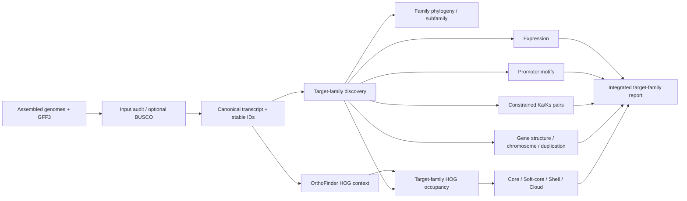

# PanFamFlow — Target Pan-Gene-Family Analysis Workflow

**English** | [简体中文](README.zh-CN.md) | [中文交互式教程](docs/index.html) | [51-item coverage audit](docs/ANALYSIS_COVERAGE.zh-CN.md) | [Project site](https://lianglunping.github.io/PanFamFlow/index.html?rev=pages-entry-fix-20260819) | [Online tutorial](https://lianglunping.github.io/PanFamFlow/tutorial/)

[](CHANGELOG.md)
[](pyproject.toml)
[](environment.yaml)
[](https://github.com/lianglunping/PanFamFlow/actions/workflows/ci.yml)
[](LICENSE)

PanFamFlow is a configuration-driven workflow for analysing one **target gene family** across multiple assembled and annotated genomes or accessions. It integrates family-member discovery, phylogeny, target-family HOG occupancy, Core/Soft-core/Shell/Cloud classification, gene structure, chromosome distribution, duplication mode, Ka/Ks, promoter motifs, expression patterns, and an integrated report.

Routine use is controlled through one `config.yaml`. A Python CLI performs strict validation, module selection, and dependency expansion. Snakemake manages the DAG, incremental execution, failure recovery, and cluster scheduling. Rule-level bioinformatics software is isolated with conda/mamba, while Python dependencies are locked with uv.

The current version is **v0.1.2-alpha**. The software structure, unit tests, toy data, and smart-resume behaviour have been validated, but a full end-to-end biological benchmark on a real large rice target-family dataset has not yet been completed. Example results are engineering fixtures and must not be interpreted as research findings.

## Scope: what PanFamFlow does not do

PanFamFlow is **not a pangenome assembly workflow**. It does not:

- assemble individual genomes from raw reads;
- construct graph pangenomes;
- run minigraph, PGGB, Cactus, or related whole-genome graph builders;
- perform general whole-genome SV/PAV calling;
- classify every genome-wide HOG as a pangenome category;
- interpret annotation absence directly as validated gene loss.

The required starting point is an **assembled genome FASTA plus matching GFF3 annotation**. OrthoFinder may use complete canonical proteomes to infer HOG context, but the `pan_family` downstream module is restricted to genes listed in `family_members.tsv`. See [docs/SCOPE.md](docs/SCOPE.md).

## Core analytical units

| Field or concept | Meaning | Must not be treated as |
|---|---|---|
| `stable_id` | `SpeciesID__GeneID`, the workflow-wide key for a target-family gene | transcript isoform |
| `subfamily` | a family subgroup defined using reference genes, family phylogeny, and domain architecture | automatically equivalent to a HOG |
| `HOG_ID` | a hierarchical orthogroup at a selected OrthoFinder species-tree node | a graph-pangenome locus |
| `pan_family_class` | occupancy class of a target-family HOG across configured genomes | a whole-genome pangenome class |
| presence/absence | annotation- and HOG-level occupancy state | validated gene gain or loss |

## Design basis

PanFamFlow was developed from two project source documents:

- `03-泛基因家族分析-模板.pdf`;
- `comparative_genomics_gene_family_workflow_20260807.md`.

Those materials define a target-family workflow involving HMMER/BLASTP, IQ-TREE, Core/Soft-core/Shell/Cloud classification, MCScanX/DupGen_finder, Ka/Ks, 2 kb promoters, PlantCARE/FIMO, and RNA-seq. PanFamFlow adds canonical-transcript control, stable IDs, rejected-candidate auditing, explicit HOG-node selection, input SHA256 tracking, smart resume, and an integrated master table. See [docs/DESIGN_BASIS.md](docs/DESIGN_BASIS.md) for the requirement-to-implementation mapping.

The two sources contain 51 named analysis items (4.1–11.5). PanFamFlow does **not** claim that all 51 are automated: the audited current distribution is 11 `IMPLEMENTED`, 29 `CONDITIONALLY_AVAILABLE`, 2 `EXTERNAL_IMPORT`, and 9 `NOT_SUPPORTED`. See the [human-readable audit](docs/ANALYSIS_COVERAGE.zh-CN.md) and [machine-readable table](docs/ANALYSIS_COVERAGE.tsv) before interpreting scope.

## Main features

- **Single configuration entry point**: routine analysis is controlled through `config.yaml`.
- **Target-family scope lock**: `project.analysis_scope` is fixed to `target_pan_gene_family`; `pan_family` cannot switch to a whole-genome mode.
- **Selective execution**: repeat `-m` to request specific modules; dependencies are expanded automatically.
- **Smart resume**: completed and still-valid jobs are skipped; failed, incomplete, missing, or invalidated jobs are rerun.
- **Non-destructive outputs**: raw genome/GFF3/FASTQ inputs are never overwritten; intermediates go to `work/`, results to `results/`.
- **Stable identifiers**: target-family genes use `SpeciesID__GeneID` consistently.
- **Visible audit gaps**: rejected candidates and family members missing from the selected HOG node are retained explicitly.
- **Publication-oriented deliverables**: structured results are written as TSV and XLSX; figures are designed for PDF and high-resolution PNG output.
- **Local and HPC execution**: local and SLURM profiles are provided.
- **Biological start gate**: a fail-closed benchmark audit can freeze the target family, 5–10 assembled genomes, input SHA256 values, and manually reviewed positive/negative controls before a real run starts.
- **Real-data smoke test**: `examples/rice_3group_pilot/` records a three-group GJ/XI/Wild gzip-input audit without committing raw genomes.
- **Beginner and scientific tutorial**: a self-contained Chinese HTML guide preserves the 12-step runbook and adds eight scientific chapters covering concepts, rationale, execution, result reading, QC, supported/unsupported conclusions, failure modes, and all 51 audited analysis items.

## Workflow overview



## Quick start

### 1. Clone the standalone repository

```bash
git clone https://github.com/lianglunping/PanFamFlow.git
cd PanFamFlow
test -f pyproject.toml
test -f src/panfamflow/workflow/Snakefile
```

### 2. Create the Snakemake engine environment

```bash
mamba env create -f environment.yaml
```

For an existing environment:

```bash
mamba env update -n panfamflow-engine -f environment.yaml --prune
```

### 3. Install the Python CLI with uv

```bash
uv sync --locked --dev
```

Run `uv lock` only when intentionally changing Python dependencies, and review the resulting `uv.lock` diff.

### 4. Initialise an analysis workspace

```bash
uv run panfamflow init my_pan_family_project
cd my_pan_family_project
```

The command creates:

```text
my_pan_family_project/
├── config.yaml
├── .panfamflow/config.schema.json
├── data/
├── references/
├── results/
├── work/
└── logs/
```

### 5. Prepare inputs

Each genome or material must provide at least:

```text
data/<species>/genome.fa
data/<species>/annotation.gff3
```

`protein.fa` and `cds.fa` may be supplied as provenance inputs. By default, canonical protein and CDS sequences are regenerated from the genome and GFF3 to reduce annotation-version mixing.

At least one family-evidence channel must be enabled:

```yaml
family:
  name: GPAT
  combine_evidence: intersection
  hmm:
    enabled: true
    hmm: references/PF01553.hmm
  blast:
    enabled: true
    reference_proteins: references/known_GPAT.pep.fa
```

### 6. Validate, plan, and run

```bash
uv run panfamflow validate -c config.yaml
uv run panfamflow plan -c config.yaml
uv run panfamflow run -c config.yaml
```

The default launcher invokes:

```text
mamba run -n panfamflow-engine snakemake ...
```

## Biological benchmark start gate

Passing software CI does not establish biological validity. Before a real rice target-family analysis, initialise a separate benchmark workspace:

```bash
uv run panfamflow benchmark init benchmarks/rice_pilot
cd benchmarks/rice_pilot
uv run panfamflow benchmark audit \
  --manifest benchmark.yaml \
  --output audits/intake_001 \
  --allow-blocked
```

The audit produces:

```text
benchmark_readiness.tsv
benchmark_readiness.xlsx
benchmark_readiness.json
benchmark_readiness.md
benchmark_readiness.html
input_files.tsv
SHA256SUMS.tsv
```

The Chinese HTML report is intended for human review, while JSON/TSV support automation and cross-session continuity. The gate is fail-closed: unresolved family definitions, fewer than five independent assembled genomes, missing or mismatched input checksums, or insufficient manually reviewed controls keep the status at `BLOCKED`. Multiple BAM/VCF samples aligned to one reference coordinate system are `reference_aligned_sample` records and cannot substitute for independent assembled genomes. See [docs/BIOLOGICAL_BENCHMARK.md](docs/BIOLOGICAL_BENCHMARK.md).

## Run selected modules only

In `config.yaml`:

```yaml
run:
  modules:
    - family
    - phylogeny
    - pan_family
```

Temporary CLI selection:

```bash
uv run panfamflow run -c config.yaml \
  -m family \
  -m phylogeny \
  -m pan_family
```

Dependencies are expanded automatically:

```text
pan_family
├── family
│   └── normalize
│       └── qc
└── orthology
    └── normalize
```

The old pre-release name `pangenome` is retained only as a narrow compatibility alias for `pan_family`. New configurations and documentation do not use it, and `whole_genome` scope is rejected during configuration validation.

## Smart resume and automatic skipping

Default execution settings:

```yaml
run:
  resume_mode: smart
  keep_going: true
  rerun_incomplete: true
  retries: 1
  rerun_triggers: [mtime, input, params, code, software-env]
```

After a failure, correct the input, parameter, environment, or resource problem and rerun the original command:

```bash
uv run panfamflow run -c config.yaml
```

Explicit status and resume commands are also available:

```bash
uv run panfamflow status -c config.yaml
uv run panfamflow resume -c config.yaml
```

Recovery combines Snakemake job-level skipping, atomic output publication, IQ-TREE checkpoints, signature-isolated OrthoFinder work directories, and per-pair Ka/Ks caches. See [docs/RESUME.md](docs/RESUME.md) for failure-injection acceptance tests.

## Modules and primary outputs

| Module | Scope | Primary output |
|---|---|---|
| `qc` | input audit for assembled genome/GFF3 and optional BUSCO | `00_qc/qc.done` |
| `normalize` | longest-CDS transcript, stable IDs, canonical sequences | `01_normalized/normalized.done` |
| `family` | target-family HMMER/BLASTP discovery and rejection audit | `02_family/family_members.tsv` |
| `phylogeny` | target-family MAFFT/ClipKIT/IQ-TREE | `03_phylogeny/family.treefile` |
| `gene_structure` | target-family gene/CDS/exon/intron/UTR metrics | `04_gene_structure/gene_structure_metrics.tsv` |
| `orthology` | whole-proteome HOG context used only for target-family projection | `05_orthology/orthofinder.done` |
| `pan_family` | target-family HOG occupancy, four classes, rarefaction | `06_pan_family/pan_family_classification.tsv` |
| `chromosome` | target-family coordinates, counts, and density | `07_chromosome/chromosome_distribution.tsv` |
| `duplication` | target-family duplication mode | `08_duplication/duplication_mode.tsv` |
| `kaks` | constrained target-family orthology/duplication pairs | `09_kaks/kaks_pairs.tsv` |
| `promoter` | target-family promoters and motifs | `10_promoter/promoter_elements.tsv` |
| `expression` | target-family expression matrix/TPM | `11_expression/expression_matrix.tsv` |
| `report` | master table, manifest, software versions, HTML | `report/index.html` |

Additional `pan_family` outputs:

```text
06_pan_family/
├── pan_family_classification.tsv
├── family_hog_membership.tsv
├── family_presence_absence.tsv
├── unassigned_family_members.tsv
├── pan_family_rarefaction_iterations.tsv
├── pan_family_rarefaction_summary.tsv
└── pan_family_results.xlsx
```

`unassigned_family_members.tsv` prevents genes from disappearing silently when the selected HOG node, stable IDs, or OrthoFinder outputs do not match.

## Result layout

```text
results/
├── 00_qc/
├── 01_normalized/
├── 02_family/
├── 03_phylogeny/
├── 04_gene_structure/
├── 05_orthology/
├── 06_pan_family/
├── 07_chromosome/
├── 08_duplication/
├── 09_kaks/
├── 10_promoter/
├── 11_expression/
├── 12_integrated/master_gene_table.tsv
└── report/
    ├── index.html
    ├── result_manifest.tsv
    ├── software_versions.tsv
    └── run_info.json
```

See [docs/OUTPUT_SCHEMA.md](docs/OUTPUT_SCHEMA.md) for field definitions.

## Methodological boundaries

1. `orthofinder.hog_node: auto` is for discovery only; formal results should freeze the appropriate `N*` node for the target clade.
2. A family-tree clade, family subfamily, HOG, and pan-locus are different concepts and are not equated automatically.
3. Core/Soft-core/Shell/Cloud categories describe occupancy of target-family HOGs, not a pangenome assembly.
4. The current 0/1 matrix is annotation- and HOG-based. Absence is not automatically gene loss; important cases require TBLASTN/miniprot, synteny, and assembly-gap review.
5. Pairwise `Ka/Ks > 1` is a candidate signal and does not replace codeml or HyPhy models.
6. Physical coordinates from different species are not placed directly on one coordinate axis; use species facets or synteny projection.
7. Cross-species TPM values are not used for direct absolute-expression claims; prefer within-species standardisation and response direction.
8. v0.1.2-alpha does not yet automate DESeq2 contrasts, codeml, genome-level rescue of apparent absence, or every composite figure in the source template.

See [docs/AUDIT.md](docs/AUDIT.md) for the independent-style audit and [docs/ROADMAP.md](docs/ROADMAP.md) for planned extensions.

## Analysis results and handoff

Large analysis archives are not stored in GitHub. The repository retains documentation, pointers, manifests, checksums, current status, and small examples; versioned delivery packages and current HSP results are stored in the [PanFamFlow Google Drive handoff folder](https://drive.google.com/drive/folders/19hvhBow_Kctuz_xOhEAuqqM64t0xbj1E).

- **Complete handoff package**
  - [Complete handoff ZIP](https://drive.google.com/file/d/16uBmPgq7hn4okky19LqL4Z2j89p2WLvG/view)
  - [Chinese handoff notes](https://drive.google.com/file/d/1un8XYECtKdF53C0XzxWyBppMFrXym7w3/view)
  - [Handoff HTML](https://drive.google.com/file/d/12B1QQDAHzc70w9f3DngWCuS_VuYHw1i-/view)
- **Current analysis results and human-readable reports**
  - [Seven-material Pfam 38 result ZIP](https://drive.google.com/file/d/1hC--IjYnTnaqV9GtP70lTnXtT3CBMO6G/view)
  - [Current audit workbook](https://docs.google.com/spreadsheets/d/1a2TtOKq1byNI5r2_n2dOgXfqh-SXdGSh/edit)
  - [Current Chinese analysis report](https://drive.google.com/file/d/1q-pX8bJChoKfyf8HNJDM69WITBLppkvC/view)
  - [Formal delivery report](https://drive.google.com/file/d/1QAq3S_25uYdiku1jYGp1hCMkUlco66E_/view)
- **Machine-readable state**
  - [HANDOFF_STATUS.json](https://drive.google.com/file/d/1UvcLRF2hgK0tXmUpbRp46Kj4G8gELER5/view)
  - [FILE_INDEX.tsv](https://drive.google.com/file/d/1ieihYM_dz7GC0ioBM8s3rRKrJjv_ma_L/view)
  - [Drive upload manifest](https://drive.google.com/file/d/1exvhDGtUYNf3OVFd8uXF9mlQmu-TQJ1W/view)
- **Integrity verification**
  - [Complete handoff ZIP SHA256](https://drive.google.com/file/d/19NGVNbX3yoHTLP8BdlePaSjix4y_DT3U/view)
  - [Current result ZIP SHA256](https://drive.google.com/file/d/13HH8Myyqjrjn8GV9LG7wiYHmKRm6TZ5B/view)

Current scientific baseline: 7 materials, 6 independently analysed HSP family tracks, 1,635 evidence records, 1,323 PASS, 205 REVIEW, 107 REJECT, and 1,254 double-evidence PASS. The benchmark remains **BLOCKED** because `acceptance.approval_state = proposed`; this deployment and documentation repair does not change that scientific status.

## HPC / SLURM

```bash
mamba env create -f environment-slurm.yaml
```

Project configuration:

```yaml
run:
  engine_env: panfamflow-engine-slurm
  profile: /absolute/path/to/PanFamFlow/profiles/slurm
```

Background submission and staged-backoff monitoring are described in [docs/HPC.md](docs/HPC.md).

## Development and validation

```bash
uv run ruff check .
uv run ruff format --check .
uv run mypy src/panfamflow
uv run pytest -q
uv build
```

Toy Snakemake dry-run:

```bash
uv run --with 'snakemake==9.25.1' snakemake \
  --snakefile src/panfamflow/workflow/Snakefile \
  --configfile examples/toy/config.yaml \
  --directory examples/toy \
  --cores 2 \
  --dry-run \
  results/00_qc/qc.done
```

A software-engineering publication claim requires the complete source tree at the repository root and passing CI for the corresponding commit. Validation records are documented in [docs/VALIDATION.md](docs/VALIDATION.md).

## Standalone repository history

PanFamFlow was initially incubated inside `Wild-rice-Pangenome-Project`. It has been separated to avoid conflating **target pan-gene-family analysis** with a wild-rice pangenome assembly project. The scientific scope remains target-family-centred and excludes pangenome assembly or graph-pangenome construction.

## Citation and licence

When using PanFamFlow, cite the original software used by the enabled modules. Software citation metadata are provided in [CITATION.cff](CITATION.cff). PanFamFlow is licensed under the MIT License; third-party tools retain their respective licences.
